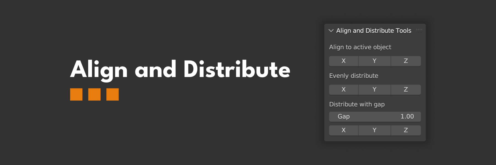

# Align and Distribute Tools

Align and Distribute Tools is a free Blender add-on designed to simplify the process of aligning and distributing objects.

## Features

- Align objects to the active object.
- Distribute objects evenly.
- Distribute objects using a fixed gap.

## Installation

Check the instalation instructions [here](https://docs.blender.org/manual/en/latest/editors/preferences/addons.html#installing-add-ons)

## How to use

### Aligning objects

1. Select at least two objects
2. Select the [active object](https://docs.blender.org/manual/en/latest/scene_layout/object/selecting.html#selections-and-the-active-object) ( the algorithm will align the objects based on this one).
3. Click on one of the alignment options `X`, `Y` or `Z`

### Distributing Objects Evenly

1. Select at least three objects
2. Click on one of the "Distribute Evenly" options: `X`, `Y`, or `Z`.
   - In this mode, the algorithm will distribute the objects evenly between first and the last element

### Distributing Objects Using a Fixed Gap

1. Select at least two objects
2. Select the [active object](https://docs.blender.org/manual/en/latest/scene_layout/object/selecting.html#selections-and-the-active-object) ( the algorithm will distribute the objects starting from this one).
3. Adjust the gap (only positive values are accepted)
4. Click on one of the "Distribute with Gap" options: `X`, `Y`, or `Z`.
   - Clicking again in any of the axes will invert the gap.

## Demo

https://user-images.githubusercontent.com/9062786/226111783-fd2bb540-8e4d-4a81-b694-609fbee42259.mov

## Contributing

Found a bug? Have any feedback? Feel free to open an [issue](https://github.com/Tuily/bl-align-and-distribute/issues)
